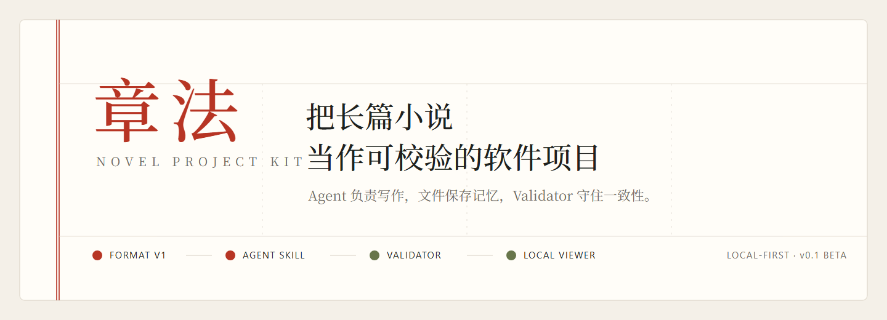

<p align="center">
  
</p>

<p align="center">
  <a href="https://mickeywzt.github.io/novel-project-kit/"><strong>在线体验</strong></a>
  · <a href="#30-秒开始">30 秒开始</a>
  · <a href="#它如何工作">工作方式</a>
  · <a href="#安装-novel-skill">安装 Skill</a>
  · <a href="https://github.com/MickeyWzt/novel-project-kit/releases">Releases</a>
</p>

<p align="center">
  <a href="https://github.com/MickeyWzt/novel-project-kit/actions/workflows/ci.yml"></a>
  <a href="https://github.com/MickeyWzt/novel-project-kit/releases"></a>
  
  <a href="LICENSE"></a>
  
</p>

> 长篇写作真正困难的不是生成一章，而是让人物、时间线、伏笔与创作决定在几十章之后仍然彼此一致。

**章法**把小说变成一个本地、可读、可校验的项目：Agent 负责写作，Skill 规定流程，文件保存长期记忆，Validator 守住一致性，Viewer 把创作状态还给作者。

<p align="center">
  <a href="https://mickeywzt.github.io/novel-project-kit/">
    
  </a>
</p>

## 一套完整的长篇创作闭环

| | 组成 | 负责什么 |
| --- | --- | --- |
| **01** | **Novel Project Format v1** | 用 Markdown、JSON 与 JSONL 保存正文、人物、故事弧、时间线、伏笔和当前状态。 |
| **02** | **Novel Skill** | 告诉文件型 Agent 何时读取、规划、写作、复审和更新状态，并尊重作者锁定的 Canon。 |
| **03** | **Validator CLI** | 检查 Schema、重复 ID、悬空引用、章节状态、时间线顺序与伏笔状态。 |
| **04** | **Local Viewer** | 直接在浏览器中读取本地小说目录，查看总览、章节、人物、故事弧、时间线、伏笔与世界观。 |

### 它如何工作


`state/locks.json` 是作者的权限边界。文件锁和字段锁优先于 Agent 生成内容；Skill 只保存小说事实与创作决定，不保存模型的内部思考过程。

## 30 秒开始

### 只想看看

打开 **[在线 Viewer](https://mickeywzt.github.io/novel-project-kit/)**。页面会先载入《昨日醒来的人》结构化演示；点击“打开小说项目”或拖入自己的项目目录，即可在浏览器中查看。

### 创建自己的项目

需要 Node.js 22 或更高版本：

```powershell
git clone https://github.com/MickeyWzt/novel-project-kit.git
cd novel-project-kit
npm.cmd install
node bin/novel.mjs init D:\Novels\my-novel
node bin/novel.mjs validate D:\Novels\my-novel
```

`init` 只会写入空目录，避免覆盖已有小说。随后可查看项目统计：

```powershell
node bin/novel.mjs stats D:\Novels\my-novel
```

### 在本地打开 Viewer

Windows 可以直接双击仓库根目录中的 **`启动章法.cmd`**，也可以手动运行：

```powershell
npm.cmd run dev -- --port 4173
```

然后打开 <http://localhost:4173/>。不要直接双击 `index.html`；`file://` 无法运行 Vite 模块。

## 一个小说项目里有什么

```text
my-novel/
├─ novel.json          # 书名、题材、目标和当前统计
├─ story/              # 长期故事弧与软支线
├─ characters/         # 一人一档的人物状态
├─ world/              # 地点、规则与世界观
├─ plots/              # 伏笔及其推进状态
├─ timeline/           # 可追加、可引用的事件时间线
├─ plans/              # Chapter Plan
├─ chapters/           # 正文
├─ summaries/          # 章节摘要
└─ state/              # 当前状态与作者锁定规则
```

完整协议与 Agent 工作流：

- [`novel-skill/references/format-v1.md`](./novel-skill/references/format-v1.md)
- [`novel-skill/references/workflows.md`](./novel-skill/references/workflows.md)

## 安装 Novel Skill

从 [Releases](https://github.com/MickeyWzt/novel-project-kit/releases) 下载 `manage-long-form-novel-skill.zip` 并解压到 Agent 的技能目录，或直接复制仓库中的 [`novel-skill`](./novel-skill) 文件夹。

在 Codex 中可以这样开始：

```text
使用 manage-long-form-novel，在 D:\Novels\my-novel 创建一本青春悬疑小说。
```

续写时，Skill 会先读取锁定规则和相关上下文，并先让作者确认 Chapter Plan：

```text
继续写下一章。先给我看 Chapter Plan，通过后再生成整章。
```

## 本地优先与隐私

- 没有账号、后端或数据库。
- Viewer 不包含 AI API，也不会替你上传正文。
- 选择的小说文件只进入当前浏览器内存。
- 公开 GitHub Pages 网站不会保存你的小说。
- CLI 可使用 `--json` 输出机器可读的校验结果。

## 项目结构

```text
core/                  共享解析、Schema、校验和统计
bin/                   novel CLI
novel-skill/           可分发的 Agent Skill 与项目模板
examples/              结构化演示小说
src/                   React Viewer
scripts/               Demo 与静态资源脚本
tests/                 核心与 CLI 测试
docs/                  设计、计划与视觉验收证据
```

《昨日醒来的人》包含 27 个章节位和短节选，用来展示项目结构与 Viewer，不冒充一部已经写完的长篇小说；摘要中的目标字数用于模拟长篇项目状态。

## 开发与验证

```powershell
npm.cmd test
npm.cmd run check
npm.cmd run build
npm.cmd run validate:template
npm.cmd run validate:demo
```

生成的 `dist/` 可以部署到任意静态托管服务；`main` 更新后，GitHub Actions 会自动验证并部署公开 Viewer。

## 当前状态

`v0.1.0-beta` 已形成 Format、Skill、Validator 与 Viewer 的可运行闭环。现在最需要的是真实长篇项目反馈与兼容性问题；欢迎通过 [GitHub Issues](https://github.com/MickeyWzt/novel-project-kit/issues) 提交。

## License

[MIT](LICENSE) © MickeyWzt
